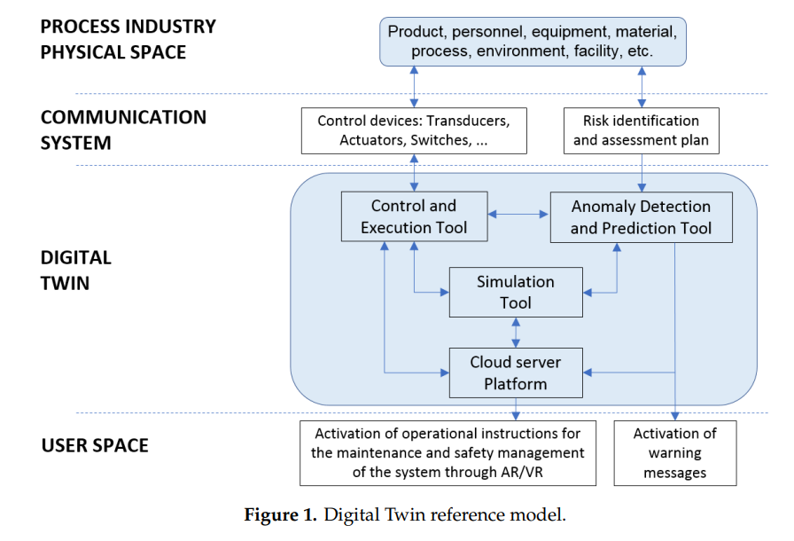

# Observability
- Observability is the ability to measure the internal states of a system by examining its outputs. A system is considered “observable” if the current state can be estimated by only using information from outputs, namely sensor data. While it might seem like a recent buzzword, [the term originated decades ago ](https://www.encyclopedia.com/history/encyclopedias-almanacs-transcripts-and-maps/kalman-rudolf-emil) with control theory (which is about describing and understanding self-regulating systems). However, it has increasingly been applied to improving the performance of distributed IT systems. In this context, observability uses three types of telemetry data — metrics, logs and traces — to provide deep visibility into distributed systems and allow teams to get to the root cause of a multitude of issues and improve the system’s performance.
- Types of telemetry data
  - metrics
  - logs
  - traces

# Digital Twin
- Observability is [necessary](https://www.nist.gov/system/files/documents/2019/04/05/08c_assesssment_of_digital_twin_manufcturing_frameworks_-_hardwick.pdf) for building a digital twin
- Digital Twin [reference](https://www.mdpi.com/2071-1050/12/3/1088/pdf) model

  

# References

- [What is Observability](https://www.splunk.com/en_us/data-insider/what-is-observability.html)